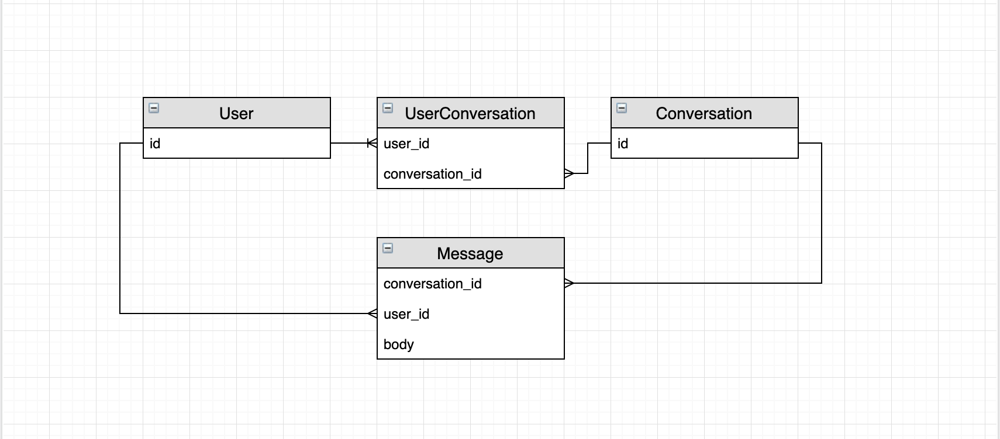

Based on the directions given, I modeled this out as a chat-style application (like slack, or imessage), in which a user has a single ongoing conversation with a person that covers many topics. This is opposed to a model such as email, in which a user can have multiple threads going with another user, and those threads are organized around a topic. This shaped both the data model and the application design.

## Technology Choices

I choose Rails for this project because Rails excels at getting full stack applications up and running quickly with a minimum of boilerplate code. For this limited project scope, Rails views work well for the frontend. In most user-facing situations, however, I would choose a Javascript framework such as React for the frontend.

I used Capybara to write integration tests. In a full production app where I was writing Ruby integration tests, I would likely also use Cucumber to organize the Capybara code into reusable steps.

The repo is using a sqlite in-memory database, only suitable for test environments, but I stuck with it here to minimize project dependencies. Postgres or MySQL would be fine production level replacements!

## Data Model

I started planning out the data model through a simple diagram:

The trickiest relationship is that between users and conversations, which I chose to model as a many to many relationship through the UserConversation model. This supports easily creating conversations with multiple users, as opposed to other approaches, such as one in which user ids lived on the conversation model.

## UI Notes

The conversations are ordered with the newest ones on top so that a user can quickly see their active conversations. Conversation timestamps get updated every time a message is created to make this simple, at the cost of being a bit confusing brand new conversations end up looking.

However, I think that a better user experience would be to call out conversations with unread messages in them. This would require a more sophisticated implementation to keep track of which user is up to date on a conversation, possibly through a "reads" table.

There are some minor aesthetic uses of the Bootstrap gem, but otherwise I did not put much effort into the styling of the application in accordance with the instructions. No thought was given to css class organization or css code style.

## Model Implementations

Model validations are nowhere as thorough as they would be in a production application. I'm not checking, for example, that conversations are unique for a given set of users (like slack or iMessage does), or validating the messages in a conversation are only from users in that conversation. As a result of this, a lot of not ideal things can happen. For example, a user can add another user to a conversation multiple times.

I'm not currently capping the length of messages, or the number of users in conversation, which probably would be ideal from both a scaling perspective and limiting abuse of this tool. I'm not using pagination for either the list of conversations or the messages within a conversation, which is a scalability concern.

Also, errors in conversation creation and message creation are either unhandled or handled very simply, and could be made much clearer to users.

In a real life application I would consider all these things!

There's a simple hand rolled user model sign in flow. I created a real user model to use in associations with the conversations and messages, but there are numerous parts of this that are not production ready, notably the plain text passwords. Not to mention the fact that users can't sign up!

## WebSockets

This was the first opportunity I've had to use Rails 6 and the ActionCable library, and I'm glad I got the chance to! It was very straightforward to get up and running and fit this use case well. That being said, this is definitely not a production ready use of WebSockets. It's undertested, mainly because the bulk of the logic is the javascript code, and I thought the effort of testing that outweighed the benefit for the project at this stage. It interacted with Turbolinks in ways that were difficult to resolve. Additionally, it's only using the async adapter, and redis would need to be configured in a production application.

## Other things I would do in the future

- There was no thought given to accessibility in the build out of this application, and I would want to audit the application for issues, as well as explore automated testing options.
- Many parts of the application could use a bit of a UI overhaul, but I think creating a conversation is a particularly clunky interaction currently.
- A lot of application logic is in the controllers--it's relatively simple right now, but I would want to extract that out to separate classes for maintainability and testability.
- Aside from a preventing n+1 queries a few places, I haven't done much query optimization. As the application scales, I would monitor performance and fix slow queries. 